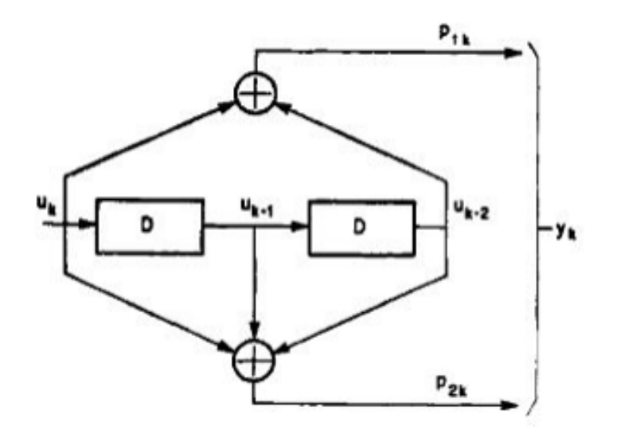

# Digital design project (2022)

## Aim of the Project
Implementing a hardware module described in VHDL which processes, with the convolutional code ½, a continuous 1-bit stream.

## Module Diagram

    

## Detailed Description

The module receives a continuous sequence of `W` words as input, each 8-bit long, and outputs a continuous sequence of `Z` words, also 8-bit long. The module serializes each of the words, generating a stream `U`, on which a ½ convolutional code is applied. Each bit `Uₖ` is encoded into 2 bits, `P₁ₖ` and `P₂ₖ`.

This operation generates an output stream `Y`, which is obtained by concatenating the bits `P₁ₖ` and `P₂ₖ`. It is noted that the length of the stream `U` is `8 * W`, while the length of the stream `Y` is `8 * W * 2`. Hence, `Z = 2 * W`.

The output sequence `Z` will be the parallelization into 8-bit words of the continuous stream `Y`.

The convolutional encoder is a synchronous sequential machine with a global clock and has a reset signal.

## Technologies Used
- Xilinx Vivado Webpack
- FPGA

## Further Information
See the project report [here](Report.pdf) (Italian)

